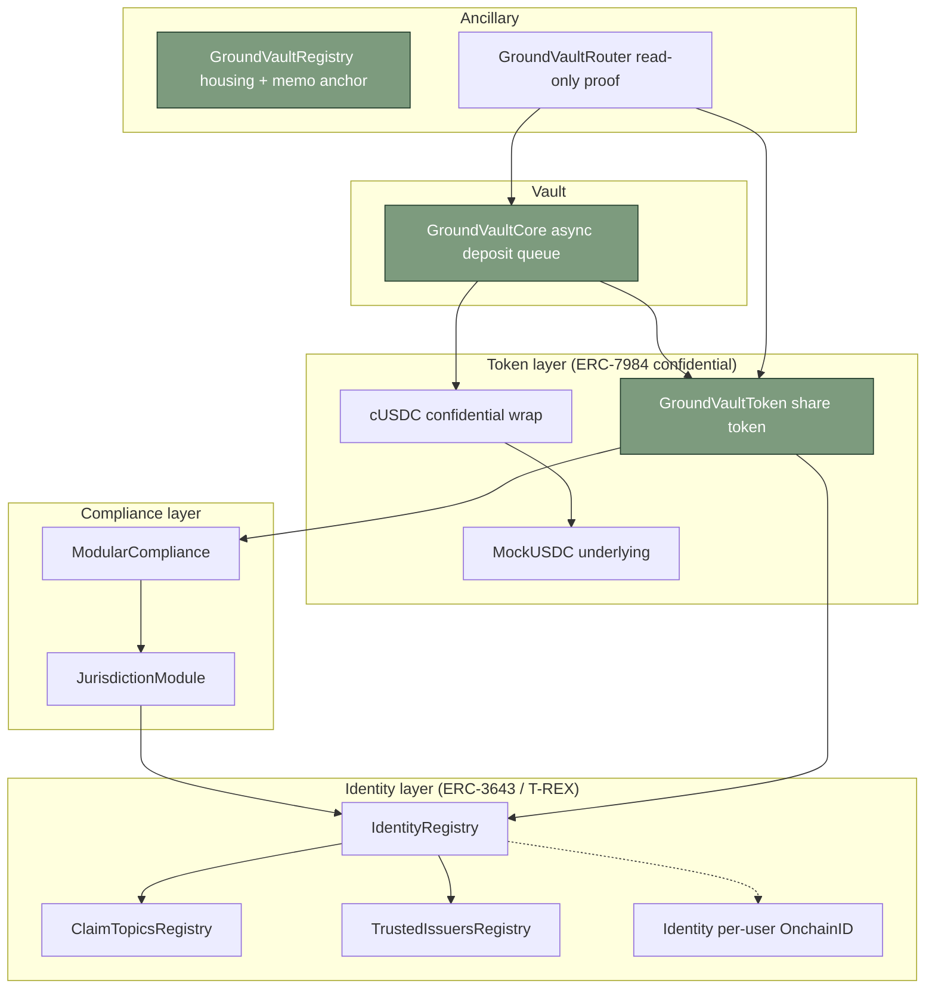

# GroundVault

> Confidential capital for Community Land Trusts.
> Private investor positions on a public chain — built on iExec Nox + ERC-7984.

[-1f3a2a)](https://sepolia.arbiscan.io/address/0x8D008Fd6c2CCE89A59D50aF08e1DAFCE39cb283b)
[](#architecture)
[](./audits/README.md)
[](#tests)
[](./LICENSE)

iExec Vibe Coding Challenge submission · Reg D 506(c) testnet prototype · No real funds at risk.

---

## What it is

GroundVault is a confidential real-world-asset (RWA) impact lending vault. Verified investors deposit confidential dollars into a vault that funds permanent-affordability housing acquisition by Community Land Trusts (CLTs). The public sees aggregate vault health and total homes funded. **Nobody sees individual positions.**

The privacy primitive is the entire point. CLTs in cities like Atlanta have lost properties to predator-bot front-running (see Raymond et al., Georgia Tech 2021, and the WIRED RealT investigation). When a CLT's treasury is publicly readable on-chain, an institutional buyer with a copy of the chain state can outbid them by exactly enough to win every property of interest. ERC-7984 stores balances as bytes32 handles; iExec Nox grants decryption only to ACL-permitted addresses. **Same chain, same numbers, two completely different visibilities.**

## Live demo

| | |
|---|---|
| **Deployed dapp** | [groundvault-app.vercel.app](https://groundvault-app.vercel.app) (Arbitrum Sepolia) |
| **Registry contract** | [`0x8D008Fd6c2CCE89A59D50aF08e1DAFCE39cb283b`](https://sepolia.arbiscan.io/address/0x8D008Fd6c2CCE89A59D50aF08e1DAFCE39cb283b) on Arbitrum Sepolia |
| **All 11 contracts** | [`deployments/arbitrumSepolia.json`](./deployments/arbitrumSepolia.json) — every contract source-verified on Arbiscan |
| **Audit reports** | [`audits/`](./audits/README.md) — ChainGPT Smart Contract Auditor, 10/11 contracts (Router deferred on credit cap) |
| **Demo script** | [`docs/demo-script.md`](./docs/demo-script.md) — 4-minute timed walkthrough |
| **Citations** | [`docs/citations.md`](./docs/citations.md) — primary sources behind every numeric claim |

## The four screens

| | Screen | What it does |
|---|---|---|
| 1 | `/verify` | Deploy a per-user OnchainID Identity contract and bind it to `IdentityRegistry` with country claim 840 (US). |
| 2 | `/deposit` | Wrap mUSDC → cUSDC, submit an encrypted deposit, watch operator advance the queue, claim GVT shares. Public chain view shows bytes32 handles only. |
| 3 | `/housing` | Aggregate vault funding strip + the live housing opportunity (960 Lawton St SW, Atlanta) + the `Why confidentiality?` predator-bot panel. |
| 4 | `/housing/:id/memo` | ChainGPT-generated impact memo with HUD CHAS + FRED data, a keccak256 anchor on `GroundVaultRegistry`, and a Provenance card that flips green when the on-chain hash matches the rendered body byte-for-byte. |
| 5 | `/audits` | Severity rollup of every ChainGPT audit report with deep links to the markdown and the verified Solidity source. |
| 6 | `/operator` | Aggregate vault stats for an OPERATOR_ROLE wallet — encrypted total supply handle, deposit-queue throughput, regenerate health. |

## Architecture

Eleven production contracts on Arbitrum Sepolia, in five dependency layers:



Headline contracts (highlighted): **GroundVaultToken**, **GroundVaultCore**, **GroundVaultRegistry**.

### Why a custom queue (not vanilla ERC-7540)

ERC-7540 specifies async deposit/redemption requests in `uint256`. ERC-7984 stores balances as `bytes32` encrypted handles. The two types do not compose: a literal ERC-7540 implementation would have to decrypt every queued amount on chain, which defeats confidentiality. `GroundVaultCore` keeps the lifecycle (PENDING → CLAIMABLE → CLAIMED) but operates entirely on bytes32 handles. `cancelDepositTimeout` is stubbed for Phase 2.6 trust hardening.

### Frontend

React + Vite + Tailwind + wagmi v2 + ethers v6 + `@iexec-nox/handle`. Vercel Edge proxies for ChainGPT and FRED keep API keys server-side. shadcn/ui + tailwindcss-animate for primitives; IBM Plex Serif/Mono + Inter for type. Forest/sage/cream palette throughout.

## Privacy story

| Public chain view | GroundVault view (with Nox ACL) |
|---|---|
| `confidentialTransfer(address,bytes)` call | `50.00 cUSDC transferred to vault` |
| `0x0000066eee23018f…` (handle) | `Vault aggregate: $4,250,000.00 USDC` |
| `recordDeposit(bytes32,bytes)` call | `pending: $50,000 of $250,000 acquisition` |

Public chain readers see opaque handles. ACL holders (the depositor + the share token + the operator) see decrypted dollars. A predator bot watching mempool sees enough to know an action happened, not enough to front-run it.

## Tests

152 unit tests on the local Hardhat network plus a live end-to-end integration test against the deployed Arbitrum Sepolia contracts. Run from the repo root:

```bash
nvm use                 # Node 20 from .nvmrc
npm install
cp .env.example .env    # fill PRIVATE_KEY, ARBITRUM_SEPOLIA_RPC_URL, ARBISCAN_API_KEY,
                        # CHAINGPT_API_KEY, FRED_API_KEY, HUD_CHAS_TOKEN
npx hardhat compile
npx hardhat test                                                            # 152 unit tests
npx hardhat test test/integration/end-to-end.integration.js \
    --network arbitrumSepolia                                               # live e2e
```

## Frontend dev

```bash
cd frontend
npm install
npm run dev             # http://localhost:8080
npm run build           # production bundle into frontend/dist
```

`VITE_ALLOW_DEMO_BYPASSES=1` enables `?wallet=mock` and `?status=verified` URL bypasses for design-state demos. Production builds should leave it unset.

## Deploying a fresh copy

The existing Arbitrum Sepolia deployment can be reused as-is. To deploy a fresh stack:

```bash
npx hardhat run scripts/deploy-all.js --network arbitrumSepolia
npx hardhat run scripts/verify-all.js --network arbitrumSepolia
```

Outputs go to `deployments/arbitrumSepolia.json`, which is the single source of truth the frontend reads via `frontend/src/lib/contracts.ts`.

## Hackathon framing

- **Reg D 506(c) testnet prototype.** Production launch requires securities counsel and a real KYC issuer. The on-chain compliance machinery is genuine; the identity issuer for the demo is the deployer wallet.
- **TEE = hardware-trust model**, not trustless. Frame as _auditable confidentiality_ — what a public chain reader cannot decrypt, a predator bot cannot front-run, but the steward (and a regulator with the right ACL) still can.
- **The CLT thesis is the point.** Tokenized RWA volume on public chains is ~$35.9B as of Nov 2025; $0 of it is permanent-affordability housing. The privacy primitive is the missing piece, not the marketing.

## Repo layout

```
contracts/         Solidity sources organized by layer
scripts/           Deploy + verify + utility scripts
test/              Hardhat unit tests + live integration tests
frontend/          React + Vite UI (six routes, Vercel-deployable)
deployments/       Network address artifacts (single source of truth)
audits/            ChainGPT Smart Contract Auditor reports + rollup
docs/              demo-script.md, citations.md, architecture notes
PLAN.md            Multi-phase implementation plan
feedback.md        iExec SDK friction log (per challenge requirements)
LICENSE            MIT
```

## License

MIT — see [LICENSE](./LICENSE).

## Acknowledgments

- **iExec** for the Nox protocol and the Vibe Coding Challenge
- **OpenZeppelin + Zama** for the ERC-7984 reference work (finalized 2025-07)
- **Tokeny / ERC3643 Association** for the T-REX standard ($32B+ tokenized assets)
- **Centrifuge / ERC4626-Alliance** for the ERC-7540 reference shape
- **ChainGPT** for the Web3 LLM and Smart Contract Auditor APIs
- **Atlanta Land Trust**, **People's CLT**, **Athens Land Trust**, and the broader CLT movement
- **HUD User CHAS** and **FRED** for the open public-data infrastructure that makes the impact memo possible
